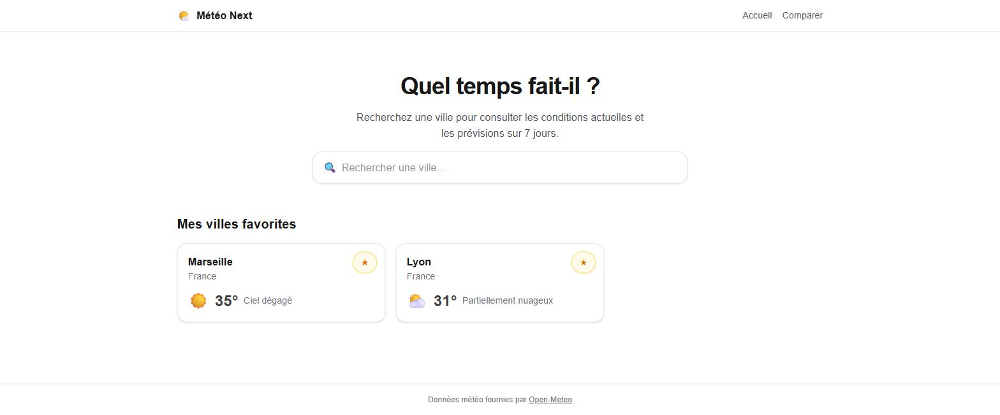
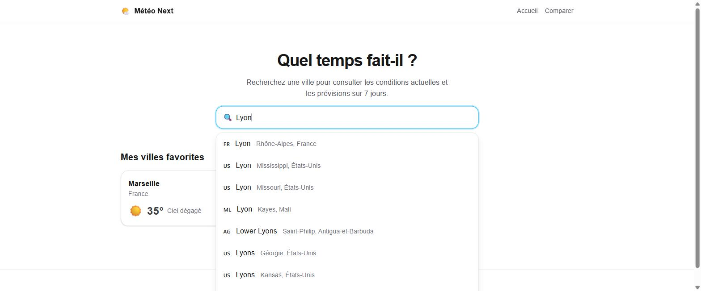
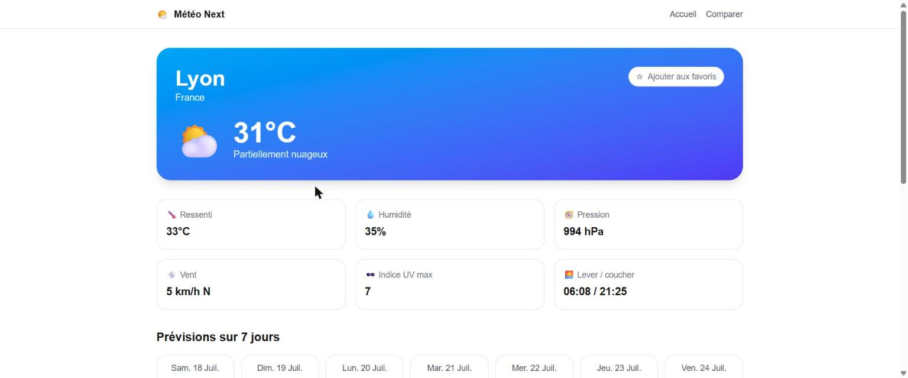
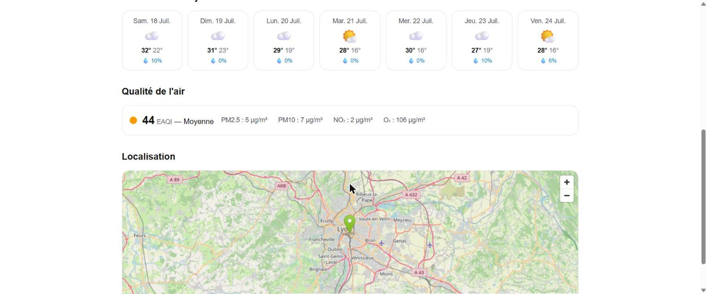
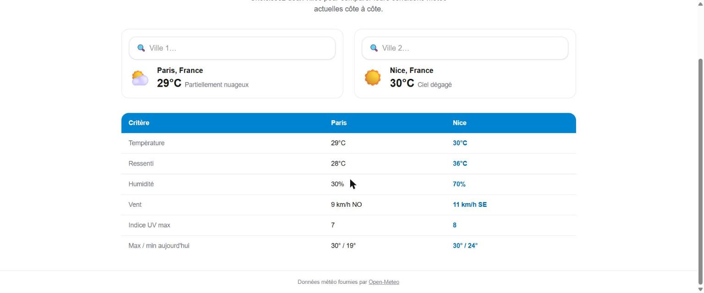

# Météo Next 🌤️

Application météo développée avec **Next.js (App Router)** et **TypeScript**. Elle permet de rechercher n'importe quelle ville dans le monde, de consulter ses conditions météo actuelles et ses prévisions sur 7 jours, de gérer une liste de villes favorites, et propose deux fonctionnalités bonus : la **qualité de l'air** et la **comparaison de deux villes**.

Les données proviennent de l'API gratuite [Open-Meteo](https://open-meteo.com/) (géocodage + prévisions + qualité de l'air), qui ne nécessite aucune clé API.

## Fonctionnalités implémentées

- **Recherche de villes** : champ de recherche avec suggestions en temps réel (debounce de 300 ms), autocomplétion via l'API de géocodage Open-Meteo, drapeau et région affichés pour distinguer les villes homonymes.
- **Page de détail** (`/ville/[nom]`) :
  - conditions actuelles : température, ressenti, humidité, pression, vent (vitesse + direction cardinale), indice UV, état du ciel avec icône ;
  - prévisions sur 7 jours : min/max, icônes météo, probabilité de précipitations ;
  - lever et coucher du soleil (dans le fuseau horaire de la ville) ;
  - carte de localisation (OpenStreetMap embarqué).
- **Gestion des favoris** : ajout/suppression depuis la page de détail ou la page d'accueil, indicateur visuel ★/☆ sur toutes les pages, persistance en `localStorage`, cartes de favoris avec météo en temps réel sur l'accueil.
- **États de chargement** : squelette (`loading.tsx`) pendant le chargement de la page de détail.
- **Gestion des erreurs** : `error.tsx` avec bouton « Réessayer » si l'API ne répond pas, `not-found.tsx` pour les villes introuvables et les routes inexistantes.
- **Responsive** : mise en page adaptée mobile / tablette / desktop (grilles fluides Tailwind), mode sombre suivant les préférences système.

## Fonctionnalités originales

Deux fonctionnalités vont au-delà du cahier des charges :

1. **Qualité de l'air** 🍃 — la page de détail affiche l'indice européen de qualité de l'air (EAQI) avec un badge coloré selon le palier (bonne → extrêmement mauvaise) ainsi que les principaux polluants (PM2.5, PM10, NO₂, O₃). Techniquement, elle utilise l'API Air Quality d'Open-Meteo, appelée **en parallèle** de l'API météo (`Promise.all`) côté serveur ; en cas d'indisponibilité de ce service, la page météo reste fonctionnelle (dégradation gracieuse).
2. **Comparaison de deux villes** ⚖️ — la page `/comparer` permet de choisir deux villes (avec la même recherche autocomplétée) et affiche un tableau comparatif côte à côte (température, ressenti, humidité, vent, UV, min/max du jour). La valeur la plus élevée de chaque ligne est mise en évidence. Pratique pour choisir une destination de week-end !

## Technologies utilisées

- **Next.js 16** (App Router, Server Components, Turbopack)
- **React 19**
- **TypeScript** (mode strict, aucun `any`)
- **Tailwind CSS 4**
- **API Open-Meteo** : géocodage, prévisions, qualité de l'air (aucune clé requise)
- **OpenStreetMap** pour la carte embarquée

## Installation & lancement

```bash
# 1. Cloner le dépôt
git clone <url-du-depot>
cd eval

# 2. Installer les dépendances
npm install

# 3. Lancer en développement
npm run dev
# → http://localhost:3000

# Ou en production
npm run build
npm run start
```

## Variables d'environnement

**Aucune variable d'environnement n'est requise** : l'API Open-Meteo est gratuite et sans clé. Il n'y a donc pas de fichier `.env.local` à créer (le `.gitignore` exclut malgré tout les fichiers `.env*` par précaution).

## Choix d'architecture

### Server Components vs Client Components

| Partie | Type | Pourquoi |
|---|---|---|
| Page de détail (`/ville/[nom]`) | **Server Component** | Les données météo sont récupérées côté serveur (`async/await` dans le composant), ce qui permet le cache de données Next.js, un premier rendu complet (SEO) et aucun appel API exposé dans le bundle client. |
| Layout, header, cartes de prévisions | **Server Components** | Purement présentationnels, aucun état ni interactivité. |
| `SearchBar` | **Client Component** | Interactivité temps réel : saisie, debounce, dropdown de suggestions. |
| `FavoriteButton`, `FavoritesList` | **Client Components** | Les favoris vivent dans le `localStorage`, uniquement accessible côté navigateur. |
| Page `/comparer` | **Client Component** | L'état (deux villes sélectionnées) est purement interactif et éphémère. |

### Gestion des favoris

Les favoris utilisent `useSyncExternalStore` avec le `localStorage` comme source de vérité : tous les composants (bouton étoile, liste de l'accueil) se resynchronisent automatiquement — y compris entre onglets via l'évènement `storage` — sans provider ni state manager externe. L'identité d'une ville est basée sur ses coordonnées arrondies, ce qui distingue les villes homonymes (il existe une trentaine de « Paris » dans le monde).

### Cache et duplication d'appels API

Tous les appels serveur passent par un client API unique (`src/lib/api.ts`) qui utilise le cache de données natif de Next.js (`fetch` + `next: { revalidate }`) : géocodage 24 h, météo 15 min, qualité de l'air 30 min. Deux visites successives de la même ville ne déclenchent donc qu'un seul appel réseau. Les appels météo + qualité de l'air de la page de détail sont parallélisés avec `Promise.all`.

### Routes

Le nom de ville seul étant ambigu, la page de détail reçoit les coordonnées en query params (`/ville/Lyon?lat=45.74&lon=4.84`). Si on accède à `/ville/Lyon` sans coordonnées (URL tapée à la main), le serveur géocode le nom et prend le premier résultat ; si la ville est inconnue, `notFound()` affiche la page 404.

### Structure du projet

```
src/
├── app/
│   ├── layout.tsx            # Layout global (header, footer)
│   ├── page.tsx              # Accueil : recherche + favoris
│   ├── not-found.tsx         # Page 404
│   ├── ville/[nom]/
│   │   ├── page.tsx          # Détail météo (Server Component)
│   │   ├── loading.tsx       # Squelette de chargement
│   │   └── error.tsx         # Erreur API + bouton réessayer
│   └── comparer/
│       └── page.tsx          # Comparaison de deux villes
├── components/               # Composants réutilisables
├── hooks/
│   └── useFavorites.ts       # Favoris (localStorage + useSyncExternalStore)
└── lib/
    ├── api.ts                # Client Open-Meteo (cache serveur)
    ├── types.ts              # Types des réponses API
    ├── utils.ts              # Helpers (URLs, formats, cardinal…)
    └── weather-codes.ts      # Codes météo WMO → libellé + icône
```

## Captures d'écran

### Accueil : recherche et favoris


### Recherche avec suggestions en temps réel


### Page de détail d'une ville


### Qualité de l'air et localisation (fonctionnalité originale)


### Comparaison de deux villes (fonctionnalité originale)

